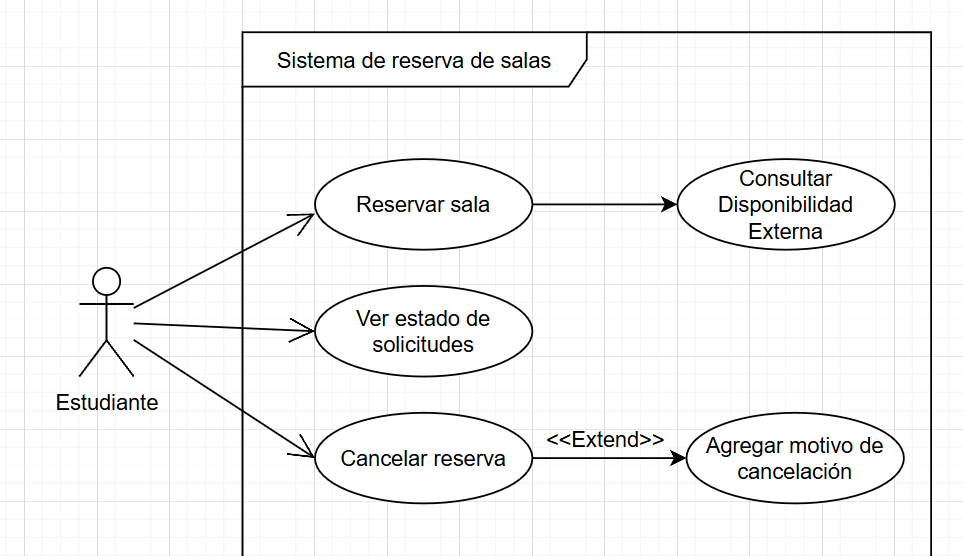
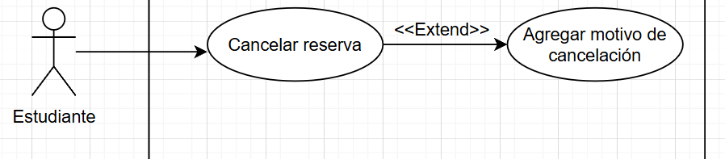

# KasaneTetoGod
** Dilan Abarca Seccion 2 **

---

# Detectar errores en 3 diagramas:

## Diagrama de caso de uso:

### Errorers:
- En ver historial de otras personas.
- En calcelar reserva falta un `<Extend>`.
- El orden en el que esta estructurado el diagrama.

### Correcciones:

#### 1- En ver historial de otras personas.

##### Justificacion:
En este caso, un estudiante pude y no debe ver el historial de solicitudes de otras personas, esa opcion corresponde al administrador del sistema.

---

#### 2- En calcelar reserva falta un `<Extend>`.

##### Justificacion:
No es estrictamente necesario indicar el motivo de una cancelacion, ya que agregar dicho motivo debe ser opcional.

---

#### 3- El orden en el que esta estructurado el diagrama.

##### Justificacion:
El orden de las acciones puede confundir a quien se le este explicando el diagrama, al ordenarlo puede ser mas sencillo de entender. (Principalmente las acciones del estudiante).

---

## Diagrama de clases:

